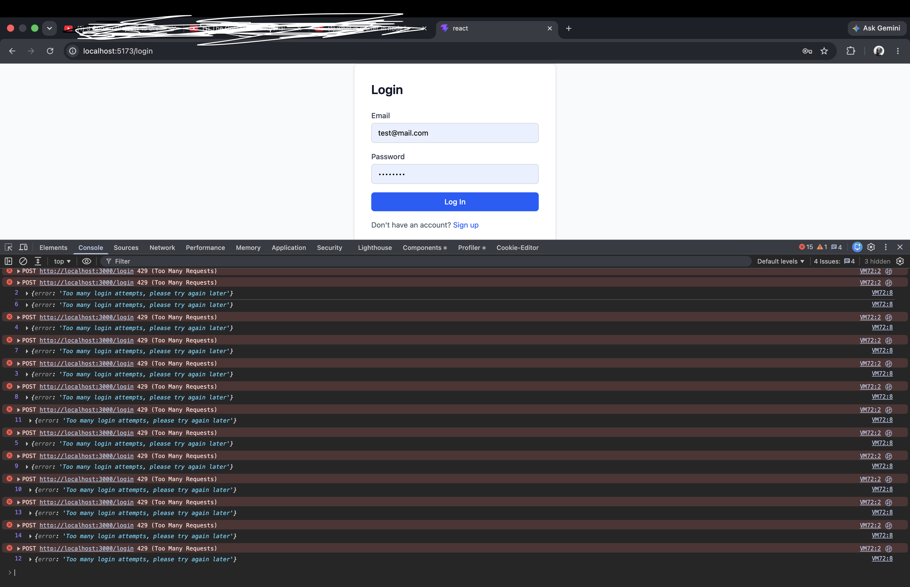
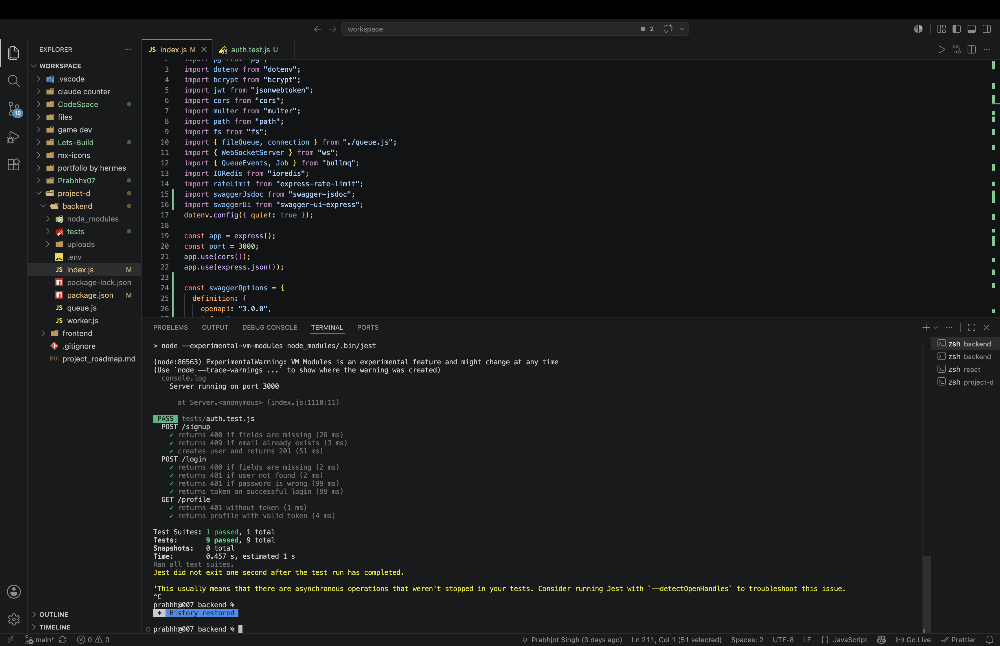
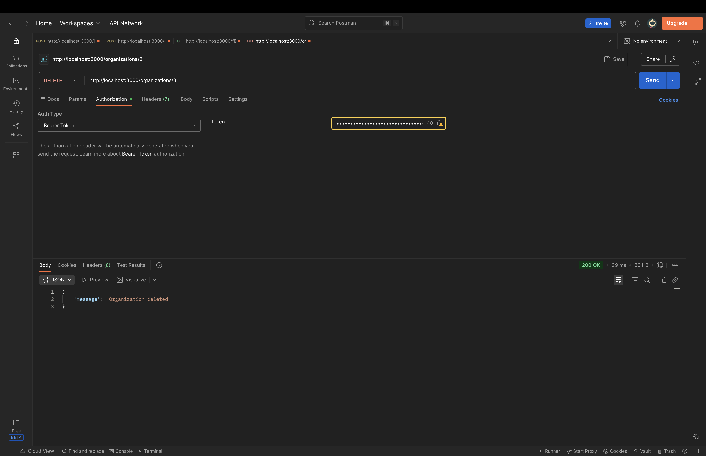

# Project-D


A full-stack multi-tenant SaaS platform for document processing and collaboration. Built from scratch to demonstrate production-grade backend engineering — JWT auth, role-based access control, async background processing, real-time notifications, caching, and CI/CD — without relying on managed auth or ORM abstractions.

---

## Features

- **Auth** — Self-built JWT authentication with bcrypt password hashing. No Supabase, no Auth0 — deliberate, to demonstrate backend depth.
- **Multi-tenancy & RBAC** — Organizations with role-based membership (admin / editor / viewer). Role lives on the membership relationship, not the user, so one user can hold different roles across different orgs.
- **File uploads** — Multer disk storage with randomized filenames, 10MB size limit, and MIME type allowlist. Files are scoped per organization.
- **Background processing** — BullMQ + Redis queue. Uploads return instantly; a separate worker process picks up jobs, processes them asynchronously, and updates file status (pending → done / failed). Includes exponential backoff retry logic.
- **Real-time notifications** — WebSocket server (ws) pushes live status updates to connected clients the moment a file finishes processing. Cross-process signaling via BullMQ QueueEvents — the worker and the API server are separate Node processes with no shared memory.
- **Caching** — Redis caches the files list per org with 60-second TTL. Cache is invalidated on upload, delete, and worker completion.
- **Rate limiting** — Global limiter (100 req / 15 min) plus a stricter auth limiter (10 req / 15 min) on login and signup to defend against credential stuffing.
- **Audit logging** — Every significant action (file upload/delete, member invite/remove/role change, org deletion) is recorded with who performed it, what they did, and when. Admins can view the full log per organization.
- **API documentation** — Swagger UI at `/api-docs`, generated from JSDoc comments in the source.
- **Testing** — Jest + Supertest unit tests for auth routes, with all infrastructure (Postgres, Redis, BullMQ) mocked via `jest.unstable_mockModule`.
- **CI/CD** — GitHub Actions runs the test suite on every push to `main`.

---

## Tech Stack

| Layer         | Choice                                      |
| ------------- | ------------------------------------------- |
| Frontend      | React + Vite, React Router, Tailwind CSS v4 |
| Backend       | Node.js + Express (ESM)                     |
| Database      | PostgreSQL via `pg` (raw queries, no ORM)   |
| Queue / Cache | Redis + BullMQ + ioredis                    |
| Real-time     | WebSockets (`ws`)                           |
| Auth          | Self-built JWT (`jsonwebtoken` + `bcrypt`)  |
| File uploads  | multer (disk storage)                       |
| API docs      | swagger-jsdoc + swagger-ui-express          |
| Testing       | Jest + Supertest                            |
| CI            | GitHub Actions                              |

---

## Architecture

```
Browser
  │
  ├── REST API (Express, port 3000)
  │     ├── Auth routes (/signup, /login, /profile)
  │     ├── Org & membership routes
  │     ├── File routes (upload, list, download, delete)
  │     └── Audit log routes
  │
  ├── WebSocket (ws:// on same port, upgraded from HTTP)
  │     └── Pushes file status updates to org subscribers
  │
Redis
  ├── BullMQ queue (file-processing jobs)
  ├── QueueEvents (cross-process job completion events)
  └── Cache (files list per org, 60s TTL)
  │
Worker process (worker.js, separate Node process)
  └── Consumes jobs → processes files → updates Postgres → triggers cache invalidation + WS push
  │
PostgreSQL
  └── users, organizations, memberships, files, audit_logs
```

Key design decisions worth noting:

- **No ORM** — Raw `pg` queries throughout. More verbose, but every query is explicit and controllable.
- **Transactions for org creation** — Creating an org and adding the creator as admin uses `BEGIN`/`COMMIT` on a reserved client from the pool, not two separate `pool.query` calls, to guarantee atomicity.
- **Role on the relationship** — `memberships.role` not `users.role`, because a user can be admin in one org and viewer in another.
- **Two separate Node processes** — The Express API and the BullMQ worker run independently. They communicate via Redis, not shared memory, which is the correct pattern for horizontally scalable background processing.
- **Cache invalidation in `notifyOrg`** — The same function that pushes WebSocket updates also clears the Redis cache, so both real-time clients and polling clients see fresh data after a status change.

---

## Local Setup

### Prerequisites

- Node.js 22+
- PostgreSQL
- Docker (for Redis)

### 1. Clone and install

```bash
git clone https://github.com/Prabhhx07/project-d.git
cd project-d
```

Install backend dependencies:

```bash
cd backend && npm install
```

Install frontend dependencies:

```bash
cd ../frontend/react && npm install
```

### 2. Start Redis

```bash
docker run -d --name redis -p 6379:6379 redis
```

### 3. Configure environment

Create `backend/.env`:

```env
DB_USER=your_postgres_user
DB_HOST=localhost
DB_NAME=project-d
DB_PASSWORD=your_postgres_password
DB_PORT=5432
JWT_SECRET=your_jwt_secret
```

### 4. Set up the database

Run the following SQL against your PostgreSQL instance:

```sql
CREATE TABLE users (
  id SERIAL PRIMARY KEY,
  name VARCHAR(100) NOT NULL,
  email VARCHAR(255) UNIQUE NOT NULL,
  password VARCHAR(255) NOT NULL,
  created_at TIMESTAMP DEFAULT NOW()
);

CREATE TABLE organizations (
  id SERIAL PRIMARY KEY,
  name VARCHAR(255) NOT NULL,
  created_at TIMESTAMP DEFAULT NOW()
);

CREATE TABLE memberships (
  id SERIAL PRIMARY KEY,
  user_id INTEGER NOT NULL REFERENCES users(id) ON DELETE CASCADE,
  org_id INTEGER NOT NULL REFERENCES organizations(id) ON DELETE CASCADE,
  role VARCHAR(50) NOT NULL CHECK (role IN ('admin', 'editor', 'viewer')),
  created_at TIMESTAMP DEFAULT NOW(),
  UNIQUE(user_id, org_id)
);

CREATE TABLE files (
  id SERIAL PRIMARY KEY,
  org_id INTEGER NOT NULL REFERENCES organizations(id) ON DELETE CASCADE,
  uploaded_by INTEGER NOT NULL REFERENCES users(id) ON DELETE CASCADE,
  filename VARCHAR(255) NOT NULL,
  original_name VARCHAR(255) NOT NULL,
  mime_type VARCHAR(100),
  size INTEGER,
  status VARCHAR(20) NOT NULL DEFAULT 'pending'
    CHECK (status IN ('pending', 'processing', 'done', 'failed')),
  created_at TIMESTAMP DEFAULT NOW()
);

CREATE TABLE audit_logs (
  id SERIAL PRIMARY KEY,
  org_id INTEGER REFERENCES organizations(id) ON DELETE CASCADE,
  user_id INTEGER REFERENCES users(id) ON DELETE SET NULL,
  action VARCHAR(100) NOT NULL,
  target_type VARCHAR(50),
  target_id INTEGER,
  metadata JSONB,
  created_at TIMESTAMP DEFAULT NOW()
);
```

### 5. Run the app

In three separate terminals:

```bash
# Terminal 1 — API server
cd backend && node index.js

# Terminal 2 — Background worker
cd backend && node worker.js

# Terminal 3 — Frontend dev server
cd frontend/react && npm run dev
```

Frontend: `http://localhost:5173`
API: `http://localhost:3000`
API docs: `http://localhost:3000/api-docs`

---

## Running Tests

```bash
cd backend && npm test
```

Tests mock all infrastructure (Postgres, Redis, BullMQ, WebSockets) so they run without any external dependencies.

---

## Project Structure

```
project-d/
├── .github/
│   └── workflows/
│       └── ci.yml
├── backend/
│   ├── tests/
│   │   └── auth.test.js
│   ├── index.js        # Express app, all routes
│   ├── queue.js        # Redis connection + BullMQ queue
│   ├── worker.js       # Background job processor
│   └── package.json
└── frontend/
    └── react/
        └── src/
            └── pages/
                ├── login.jsx
                ├── signup.jsx
                ├── dashboard.jsx
                ├── organizations.jsx
                └── organizationDetail.jsx
```

---

## Screenshots

**Rate limiting in action** — auth endpoint blocked after 10 requests in 15 minutes:


**Jest test suite** — 9 tests passing in under 500ms, all infrastructure mocked:


**Organization deletion** — cascade delete confirmed via API:

